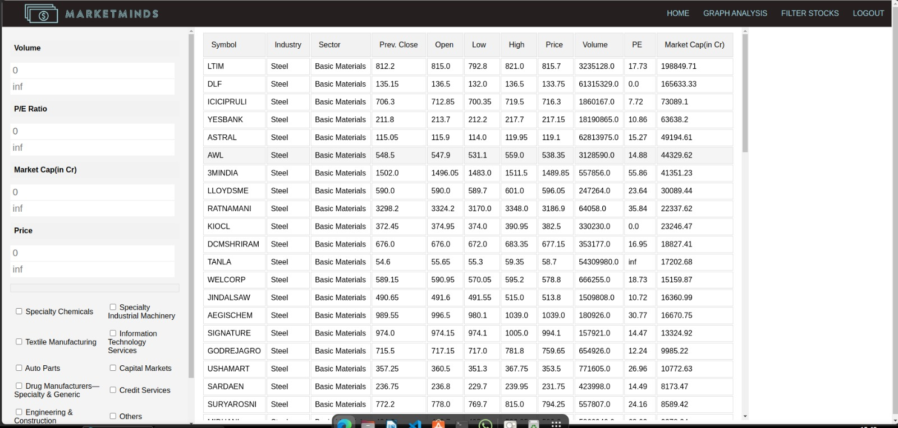

# COP290_A1_Sub2
## A Stock Watcher
This project is a basic stock analysis tool build using python flask for viewing stocks on the NSE stock exchange. The application allows the user to analyze multiple stocks and draw their price trends together so one can compare them easily. 
It also contains other information about the stocks performance like their P/E ratio and the stocks yearly high and low. One can also compare and sort different stocks based on their current prices,the volume of stocks traded their P/E ratio and more. 
The application also supports multiple user accounts each with their own favourite stocks (list of stocks which are permanently saved ) and history. 
The applicationa also keeps track of what stocks were viewed in the last session so that they can be reloaded on login, these are displayed on the welcome page.The welcome page also contains a  graph summarizing some of the stock indices on NSE.
Some screenshots showing the features described above:

###### Login page for existing users

###### Registration page for new users

###### The welcome page consists of a list of the stocks added to the favourite and a graph of various stock indices.

###### The left side contatins the list of stocks currently being viewed while the right pane contains a summary of the stocks currently selected.

##### The table pane in the grpah analysis page allows the user to download the raw data of stock prices as a CSV file.

###### The stock analysis allows the user to filter stocks based on a range of values and sort the table rows based on one of the columns. 

## Usage instructions
Currently to run the application one can install the code from github and navigate to the folder labeled COP_290_Assignment1-main and in the terminal run the make command. The application is now available on the port 127.0.0.1:5000 which can be opened through the browser. 
Application has been tested extensively on firefox seems to work on chrome as well.
Running make is only required on the first run to install the python packages required on later runs one can simply run the file app.py
On linux the command for this would be 
python3 app.py

## Requirements
The requirements to run this application are:
1. A python 3 installation with pip installed
2. cmake to install python packages
3. An internet connection to load the stock data and graphing libraries.

## Libraries Used
1. [yfinance](https://github.com/ranaroussi/yfinance) (a python library we used to get historical data of stocks on NSE)
2. [bokeh](https://github.com/bokeh/bokeh) (a python library to draw graphs has a companion javascript library to help insert graphs into html)
3. [pandas](https://github.com/pandas-dev/pandas) (used to store the stock's historical data and store it in tabular form also to read and write csv files)
